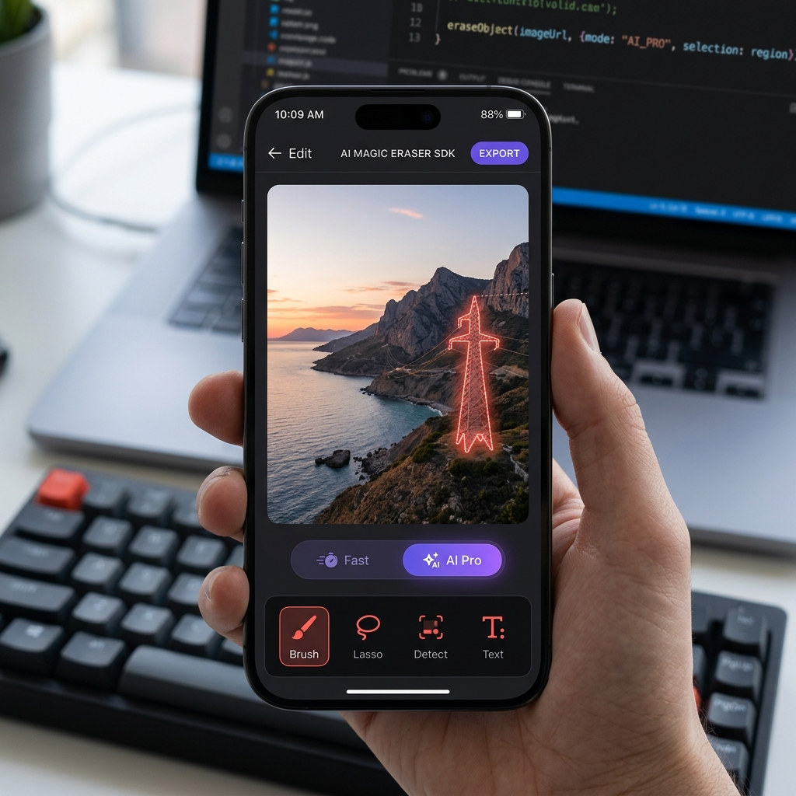

<div align="center">
  
  <br><br>
  
  
  
  
  
  <h1>🪄 Magic Eraser Android SDK</h1>
  <p><b>The ultimate fully offline, on-device AI object and text removal tool for Android applications.</b></p>
</div>

---

## 🚀 Stop Paying High Cloud API Fees
Are you currently using cloud APIs like Remove.bg, Photoroom, or ClipDrop to power object removal in your app? **Stop paying per image.**

The **Magic Eraser SDK** is a premium, 100% on-device Android library that brings desktop-grade AI erasing to your mobile app for a flat, affordable subscription fee.

### 🌟 Why Developers Choose Magic Eraser SDK:
1. **Zero Cloud Costs:** Because the AI runs entirely on the user's phone, you pay $0 in server processing fees, regardless of if your users edit 10 images or 10,000 images.
2. **Absolute Privacy:** User photos never leave the device. This is a massive selling point for privacy-conscious users and enterprise apps.
3. **Lightning Fast:** No upload or download wait times. Erasing happens instantly.
4. **State-of-the-Art AI:** Powered by LaMa Inpainting and ML Kit for flawless subject selection, object removal, and automatic text detection/erasing.

---

## 🛠️ Features Included
*   **Smart Subject Masking:** Users can tap objects to instantly select them.
*   **One-Tap Text Removal:** Automatically detects and erases text from photos.
*   **Manual Brushing:** Includes undo/redo stacks and dynamic brush sizing.
*   **Ready-to-Use UI:** A polished Jetpack Compose editor that integrates in under 5 minutes.

---

## 📦 How to Integrate
Integration is incredibly simple. We use JitPack to securely distribute the compiled SDK.

### Step 1: Add the Repository
Add JitPack in your root `settings.gradle` or root `build.gradle` at the end of repositories:

```gradle
dependencyResolutionManagement {
    repositoriesMode.set(RepositoriesMode.FAIL_ON_PROJECT_REPOS)
    repositories {
        mavenCentral()
        maven { url 'https://jitpack.io' }
    }
}
```

### Step 2: Add the Dependency
In your app-level `build.gradle`, add the SDK and sync your project:

```gradle
dependencies {
    implementation 'com.github.nsenterprise9865-stack:magic-eraser-android-sdk:1.0.3'
}
```

### Step 3: Initialize the SDK
Before launching the editor, you must initialize the SDK with your License Key.

```kotlin
import com.nsenterprise.magiceraser.sdk.MagicEraserSDK

class YourApplication : Application() {
    override fun onCreate() {
        super.onCreate()
        
        // Initialize the SDK with your unique license key
        MagicEraserSDK.initialize(this, "YOUR_LICENSE_KEY_HERE")
    }
}
```

---

## 💰 Get Your License Key
Our flat-rate plans start at just **$19/month** (which saves developers thousands of dollars compared to cloud APIs). 

To purchase a license key, or to inquire about Enterprise white-label packages, contact us directly:
✉️ **contact.nsenterprise@gmail.com**

---
*Brought to you by NS Enterprise.*
