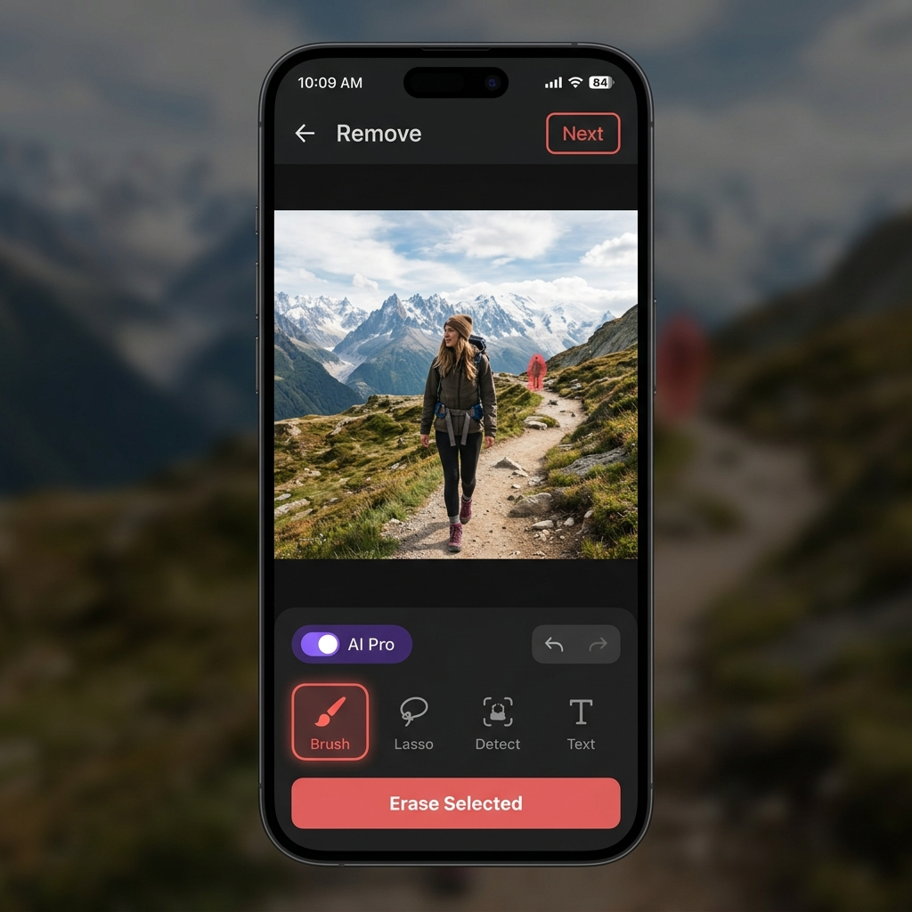
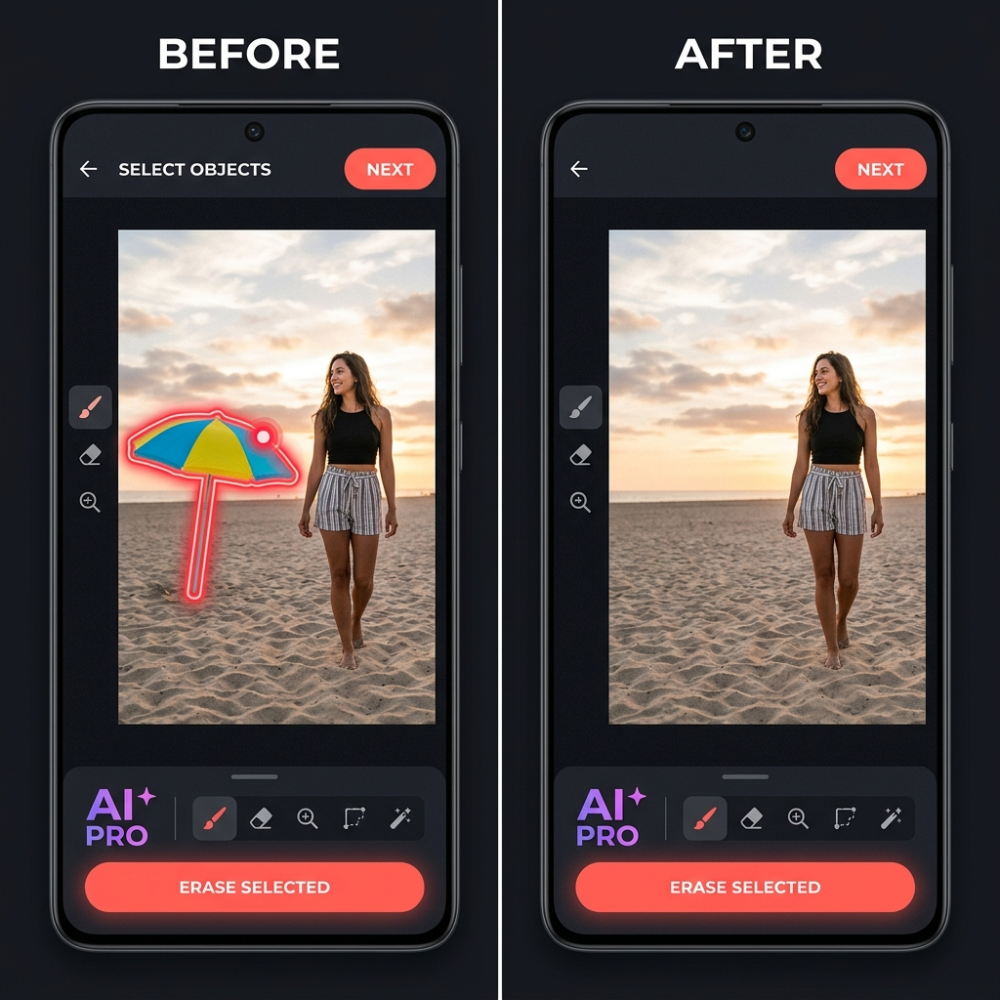

<div align="center">
  
  <br><br>
  
  
  
  
  
  
  <h1>🪄 Magic Eraser Android SDK</h1>
  <p><b>The ultimate fully offline, on-device AI object and text removal tool for Android applications.</b></p>
  
  <br>
  <a href="mailto:support@nsenterprise.dev?subject=Requesting%207-Day%20Test%20License&body=Hi%2C%20I%20would%20like%20to%20request%20a%207-day%20test%20license%20for%20the%20SDK."></a>
  <a href="https://nsenterprise.dev/download-demo.html"></a>
</div>

---

## 🚀 Stop Paying High Cloud API Fees
Are you currently using cloud APIs like Remove.bg, Photoroom, or ClipDrop to power object removal in your app? **Stop paying per image.**

The **Magic Eraser SDK** is a premium, 100% on-device Android library that brings desktop-grade AI erasing to your mobile app for a flat, affordable subscription fee.

<div align="center">
  
  <p><i>Flawless object removal powered by localized AI, processing in milliseconds.</i></p>
</div>

### 🌟 Why Top Apps Choose Our SDK:
1. **Zero Cloud Costs:** Because the AI runs entirely on the user's phone, you pay $0 in server processing fees, regardless of if your users edit 10 images or 10,000 images.
2. **Absolute Privacy:** User photos never leave the device. This is a massive selling point for privacy-conscious users and enterprise apps.
3. **Lightning Fast:** No upload or download wait times. Erasing happens instantly.
4. **State-of-the-Art AI:** Powered by NS Pro & NS Fast AI Inpainting, NS Smart Select for flawless tap-to-select, and ML Kit for automatic text detection.
5. **Fully Customizable UI:** Easily toggle premium badges (like PRO tags), change colors, and edit labels directly in the SDK config, or build a 100% custom headless UI.

---

## 💡 Perfect For Your Use Case
*   **Real Estate Apps:** Remove clutter, people, or cars from property photos instantly.
*   **E-Commerce:** Clean up product photography and remove background distractions.
*   **Social Media & Dating:** Let users erase photobombers and exes from their profile pictures.
*   **Photo Editors:** Add premium "Magic Eraser" functionality to your existing editing suite.

---

## 📦 How to Integrate (In 5 Minutes)
Integration is incredibly simple. We use JitPack to securely distribute the compiled SDK.

### Step 1: Add the Repository
Add the JitPack repository to your root project build file.

**Gradle (Kotlin DSL - `settings.gradle.kts`)**
```kotlin
dependencyResolutionManagement {
    repositoriesMode.set(RepositoriesMode.FAIL_ON_PROJECT_REPOS)
    repositories {
        mavenCentral()
        maven("https://jitpack.io")
    }
}
```

**Gradle (Groovy - `settings.gradle`)**
```groovy
dependencyResolutionManagement {
    repositoriesMode.set(RepositoriesMode.FAIL_ON_PROJECT_REPOS)
    repositories {
        mavenCentral()
        maven { url 'https://jitpack.io' }
    }
}
```

**Maven (`pom.xml`)**
```xml
<repositories>
    <repository>
        <id>jitpack.io</id>
        <url>https://jitpack.io</url>
    </repository>
</repositories>
```

### Step 2: Add the Dependency
Add the SDK to your app-level dependencies and sync your project.

**Gradle (Kotlin DSL - `build.gradle.kts`)**
```kotlin
dependencies {
    // 1. The Magic Eraser SDK
    implementation("com.github.nsenterprise9865-stack:magic-eraser-android-sdk:1.1.1")
    
    // 2. Required SDK Dependencies (AI Models & Background Sync)
    implementation("androidx.work:work-runtime-ktx:2.9.0")
    implementation("com.google.android.gms:play-services-mlkit-subject-segmentation:16.0.0-beta1")
    implementation("com.google.mlkit:text-recognition:16.0.1")
    implementation("com.microsoft.onnxruntime:onnxruntime-android:1.21.1")
    implementation(platform("com.google.firebase:firebase-bom:33.7.0"))
    implementation("com.google.firebase:firebase-firestore")
}
```

**Gradle (Groovy - `build.gradle`)**
```groovy
dependencies {
    // 1. The Magic Eraser SDK
    implementation 'com.github.nsenterprise9865-stack:magic-eraser-android-sdk:1.1.1'
    
    // 2. Required SDK Dependencies (AI Models & Background Sync)
    implementation 'androidx.work:work-runtime-ktx:2.9.0'
    implementation 'com.google.android.gms:play-services-mlkit-subject-segmentation:16.0.0-beta1'
    implementation 'com.google.mlkit:text-recognition:16.0.1'
    implementation 'com.microsoft.onnxruntime:onnxruntime-android:1.21.1'
    implementation platform('com.google.firebase:firebase-bom:33.7.0')
    implementation 'com.google.firebase:firebase-firestore'
}
```

**Maven (`pom.xml`)**
```xml
<dependency>
    <groupId>com.github.nsenterprise9865-stack</groupId>
    <artifactId>magic-eraser-android-sdk</artifactId>
    <version>1.1.1</version>
</dependency>
<!-- Ensure you also include WorkManager, ML Kit, ONNX, and Firebase dependencies -->
```

### Step 3: Initialize the SDK & Download Models
The SDK requires network initialization to verify your license and fetch the AI model URLs securely. Since `initialize()` is a suspend function, you must call it from a coroutine.

Once initialized successfully, you should start the **Background Model Downloader** so the AI model is ready before the user opens the editor.

**Example (Inside your MainActivity or Application class):**
```kotlin
import androidx.lifecycle.lifecycleScope
import com.nsenterprise.magiceraser.sdk.MagicEraserSDK
import com.nsenterprise.magiceraser.sdk.utils.ModelDownloadWorker
import kotlinx.coroutines.Dispatchers
import kotlinx.coroutines.launch

class MainActivity : AppCompatActivity() {
    override fun onCreate(savedInstanceState: Bundle?) {
        super.onCreate(savedInstanceState)
        
        lifecycleScope.launch(Dispatchers.IO) {
            // 1. Initialize the SDK with your unique license key
            MagicEraserSDK.initialize(
                context = applicationContext, 
                licenseKey = "YOUR_LICENSE_KEY_HERE"
            )
            
            // 2. If the license is valid, start downloading the AI models in the background
            if (MagicEraserSDK.isReady()) {
                ModelDownloadWorker.enqueue(applicationContext)
            }
        }
    }
}
```

*Note: `ModelDownloadWorker` uses Android's native `WorkManager` to download the models efficiently in the background, even if the user minimizes your app.*

### Step 4: Launch the Editor
The SDK provides a built-in, polished UI that takes over when your user selects a photo. You can integrate it using either modern Kotlin or traditional Java.

#### 🔹 Option A: Kotlin (Jetpack Compose)
If your app uses Compose, use the Android Photo Picker and pass the `Uri` directly into the SDK's `MagicEraserScreen`:

```kotlin
import androidx.activity.compose.rememberLauncherForActivityResult
import androidx.activity.result.contract.ActivityResultContracts
import com.nsenterprise.magiceraser.sdk.ui.MagicEraserScreen

@Composable
fun EditFeatureScreen() {
    var selectedImageUri by remember { mutableStateOf<android.net.Uri?>(null) }
    
    // 1. Setup the Android Photo Picker
    val photoLauncher = rememberLauncherForActivityResult(ActivityResultContracts.PickVisualMedia()) { uri ->
        selectedImageUri = uri
    }

    if (selectedImageUri != null) {
        // 2. Launch the Magic Eraser Editor
        MagicEraserScreen(
            onBack = { selectedImageUri = null }, // Close the editor
            initialImageUri = selectedImageUri!!,
            onSaveSuccess = { resultBitmap -> 
                // The user successfully erased objects! 
                // Do something with resultBitmap here.
                selectedImageUri = null
            }
        )
    } else {
        // 3. Your App's Button to open the gallery
        Button(onClick = { 
            photoLauncher.launch(PickVisualMediaRequest(ActivityResultContracts.PickVisualMedia.ImageOnly)) 
        }) {
            Text("Select Photo to Edit")
        }
    }
}
```

#### 🔹 Option B: Java (Traditional XML)
If you are using Java and traditional XML layouts, you can launch the SDK by starting its dedicated Activity:

```java
import com.nsenterprise.magiceraser.sdk.MagicEraserActivity;

public class MainActivity extends AppCompatActivity {
    
    // 1. Register a launcher to get the edited image back from the SDK
    private final ActivityResultLauncher<Intent> eraserLauncher = registerForActivityResult(
            new ActivityResultContracts.StartActivityForResult(),
            result -> {
                if (result.getResultCode() == RESULT_OK && result.getData() != null) {
                    Uri editedImageUri = result.getData().getData();
                    // The user successfully erased objects! Use the editedImageUri.
                }
            }
    );

    @Override
    protected void onCreate(Bundle savedInstanceState) {
        super.onCreate(savedInstanceState);
        setContentView(R.layout.activity_main);
        
        Button editButton = findViewById(R.id.editButton);
        editButton.setOnClickListener(v -> {
            // 2. Get a photo from your gallery picker, then pass it to the SDK
            Uri imageToEdit = /* ... get URI from your own gallery ... */;
            
            Intent intent = new Intent(this, MagicEraserActivity.class);
            intent.putExtra("EXTRA_IMAGE_URI", imageToEdit.toString());
            eraserLauncher.launch(intent);
        });
    }
}
```

#### 🔹 Option C: Fully Custom UI (Headless API)
If you require 100% control over the user interface (e.g. custom layout measurements, your own custom drawing canvas, and branded UI elements), the SDK provides a Headless API via `MagicEraserCore`.

This tier exposes suspending functions for generating selection masks and executing the AI models directly:

```kotlin
// 1. Ensure Model is ready
MagicEraserCore.ensureModelReady(context) { progress ->
    println("Downloading Model: $progress")
}

// 2. Pre-warm EdgeSAM when user enters Detect mode (NEW in v1.1.1)
// This generates embeddings once so every tap is instant AI segmentation
MagicEraserCore.prepareForDetect(context, imageBmp)

// 3. On user tap — full 3-tier AI detect pipeline runs automatically:
//    EdgeSAM → MLKit Subject Segmentation → Color Flood-Fill fallback
val maskPair = MagicEraserCore.buildDetectMask(
    context = context,
    source  = imageBmp,
    tapX    = 500,
    tapY    = 500
)

// 4. Apply the mask to erase
// accurateMode = true  → NS Pro (LaMa) — highest quality
// accurateMode = false → NS Fast AI (MIGAN v2) — instant
val finalImage = MagicEraserCore.applyMask(
    context      = context,
    source       = imageBmp,
    mask         = maskPair!!.first,
    accurateMode = true
)
```
*(Please refer to our Sample App's `CustomEditorActivity` for a complete reference on implementing an XML-based custom drawing canvas, Fast/Pro toggle, and tools).*

---

## 🌍 Massive Global Reach — Built for the Entire Android Ecosystem

<div align="center">

### Your app reaches **3.85 billion+ Android devices** the moment you integrate.

<br>


&nbsp;

&nbsp;

&nbsp;


</div>

<br>

> **The numbers speak for themselves.** With `minSdk = 24` (Android 7.0) and ARM64 + ARMv7 native binaries, the Magic Eraser SDK is installable on virtually every Android phone on the planet — while delivering a world-class AI experience on the 2+ billion modern devices where it matters most.

---

### 📊 Android OS Distribution (December 2025)

<div align="center">

| Android Version | API | Active Share | Supported? |
|:---:|:---:|:---:|:---:|
| Android 16 | 36 | 7.5% | ✅ Full Support |
| Android 15 | 35 | 19.3% | ✅ Full Support |
| Android 14 | 34 | 17.2% | ✅ Full Support |
| Android 13 | 33 | 13.9% | ✅ Full Support |
| Android 12 | 31 | 11.4% | ✅ Full Support |
| Android 11 | 30 | 13.7% | ✅ Full Support |
| Android 10 | 29 | 7.8% | ✅ Full Support |
| Android 9 | 28 | 4.5% | ✅ Full Support |
| Android 8 (Oreo) | 26–27 | 3.5% | ✅ Full Support |
| **Android 7 (Nougat)** | **24–25** | 0.8% | ✅ **Minimum Supported** |
| Below Android 7 | < 24 | ~0.9% | — Not Supported |

*Source: Google Play Android distribution dashboard, December 2025*

</div>

<div align="center">

### 🚀 Why Choose Magic Eraser SDK? Because **99.1% of Android devices** are already waiting for your app.

> Most AI SDKs force you to target newer devices only. **Not ours.**
> We built for the real world — where users run Android 7 through 16, on phones costing $50 or $1500.
> **One integration. 3.85 billion potential users. Zero compromise on AI quality.**

</div>

---

### 🏆 Device Tier Performance Guide

The SDK delivers a tailored, high-quality experience across every price point:

<br>

<table>
  <thead>
    <tr>
      <th align="center">Tier</th>
      <th align="center">Examples</th>
      <th align="center">RAM</th>
      <th align="center">Est. Global Reach</th>
      <th align="center">AI Performance</th>
    </tr>
  </thead>
  <tbody>
    <tr>
      <td align="center">🟢 <b>Flagship</b></td>
      <td align="center">Galaxy S25, Pixel 9 Pro, OnePlus 13</td>
      <td align="center">12–16 GB</td>
      <td align="center"><b>~700 Million</b></td>
      <td align="center">⚡ Instant — sub-1s AI inference, 120 fps UI</td>
    </tr>
    <tr>
      <td align="center">🔵 <b>Mid-Range</b></td>
      <td align="center">Galaxy A55, Redmi Note 13, Moto Edge 40</td>
      <td align="center">6–12 GB</td>
      <td align="center"><b>~1.3 Billion</b></td>
      <td align="center">✅ Smooth — 2–5s inference, fluid 60 fps UI</td>
    </tr>
    <tr>
      <td align="center">🟡 <b>Budget</b></td>
      <td align="center">Redmi 12C, Galaxy A04, Tecno Spark</td>
      <td align="center">3–4 GB</td>
      <td align="center"><b>~700 Million</b></td>
      <td align="center">⚠️ Works — 8–15s inference, lighter AI path</td>
    </tr>
    <tr>
      <td align="center">🔴 <b>Ultra-Budget</b></td>
      <td align="center">Android Go devices, ≤2 GB RAM</td>
      <td align="center">1–2 GB</td>
      <td align="center"><b>~300 Million</b></td>
      <td align="center">⚙️ Basic — ML Kit segmentation only</td>
    </tr>
  </tbody>
</table>

<br>

> 💡 **The Sweet Spot:** The Magic Eraser SDK targets the **~2 billion mid-to-high-end devices** where our AI pipeline (EdgeSAM → ML Kit → LaMa/MiGAN) runs at its full potential. That's the majority of paying app users in every major market.

---

### 🔩 Architecture & Compatibility

<div align="center">

| Requirement | Value | Coverage |
|:---:|:---:|:---:|
| **Minimum Android** | 7.0 Nougat (API 24) | 99.1% of devices |
| **Target Android** | 15 (API 35) | Latest behaviors & APIs |
| **ARM 64-bit** (`arm64-v8a`) | All modern smartphones | ~95%+ of active devices |
| **ARM 32-bit** (`armeabi-v7a`) | Older & budget devices | Fills the remaining gap |
| **x86 / x86_64** | Not included | Emulators only — 0% of real phones |

</div>

The dual-ABI packaging (`arm64-v8a` + `armeabi-v7a`) ensures **~99%+ of all real Android phones** can run the native AI inference engine at peak efficiency — no emulator shims, no performance penalties.

---

### 🌐 Regional Market Insight

Thinking about global distribution? Here's where your app will land:

| Region | Dominant Device Tier | SDK Experience |
|:---|:---:|:---:|
| 🇺🇸 North America | Flagship & Mid-Range | ✅ Full AI |
| 🇪🇺 Europe | Mid-Range & Flagship | ✅ Full AI |
| 🇨🇳 China / East Asia | Mid-Range to Flagship | ✅ Full AI |
| 🇮🇳 India | Budget to Mid-Range | ✅ Good — Fast AI mode |
| 🇧🇩 Bangladesh / SE Asia | Budget | ⚠️ Works — lighter path |
| 🌍 Africa | Budget / Ultra-Budget | ⚙️ Basic ML Kit |

The SDK's **multi-tier AI engine automatically adapts** — delivering the best result possible on whatever device your user holds.

---

## 💳 Pricing & Licensing

Flat-rate commercial licenses designed to grow with your business.

<div align="center">

| | 🌱 **Pro License** | 🏢 **Unlimited License** |
|---|:---:|:---:|
| **Users** | 1 - 10,000 | 10,000+ |
| **Price** | **$19 / month** | **$49 / month** |
| **Erasures** | Unlimited | Unlimited |
| **Support** | Standard email | Priority support |
| | [**Get Pro →**](mailto:hello@nsenterprise.dev?subject=Pro%20License%20Request) | [**Get Unlimited →**](mailto:hello@nsenterprise.dev?subject=Unlimited%20License%20Request) |

</div>

<br/>

### 🌍 Global Enterprise Licensing (Payment & Fulfillment)

To initiate a commercial software license agreement, please contact our Enterprise Licensing Desk at **[hello@nsenterprise.dev](mailto:hello@nsenterprise.dev)** specifying your desired tier and organization details. 

We process all global B2B transactions via the following secure networks:
- **🏦 USD ACH Transfer / Swift:** We will issue a formal corporate invoice for direct routing to our JP Morgan Chase NA corporate account.
- **🪙 Enterprise Crypto Settlement:** For instant, borderless fulfillment, we accept USDT/USDC via major blockchain networks. 

*Upon payment verification, our licensing team will instantly provision your production API Keys and dispatch your official tax-compliant receipt.*

---

### 🇧🇩 Bangladesh Purchase (bKash)

Users from Bangladesh can pay by bKash. Please contact us for bKash details at support@nsenterprise.dev.

---
*Brought to you by NS Enterprise.*
